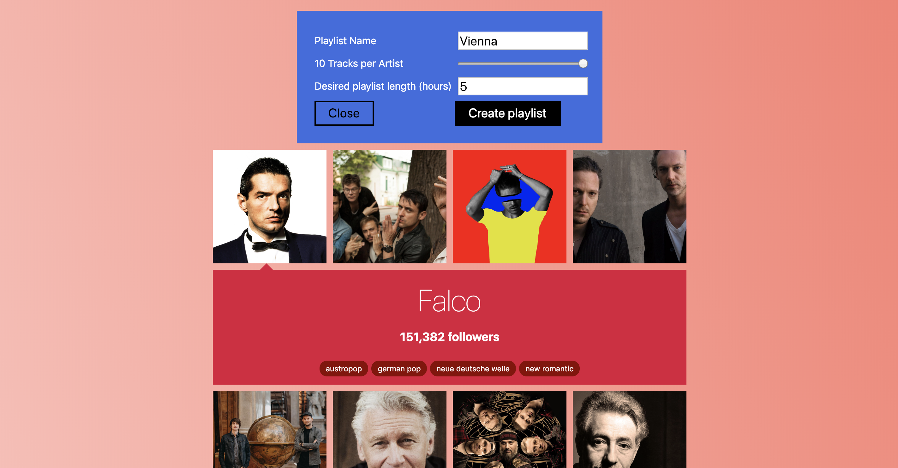

# Travel with Spotify

Takes a Wikipedia page of a place. Creates a Spotify playlist from artists with a connection to that place. If a playlist with the desired name already exists, they will be added to that one.

## TODO, if I'm super bored

- Fix some relations (e.g. Behemoth isn't connected to Poland)
- Make proper loading indicator

## Develop

- `npm install`
- `npm run dev`

The app never saves state anywhere, means it does the OAuth2 redirect all the time.

## Build

- `npm run build`
